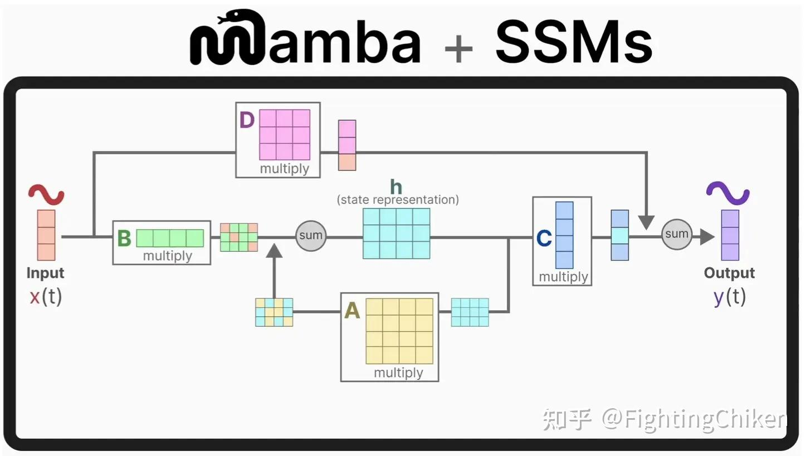

# Mamba-FPGA

This project implements a full **MNIST digit inference pipeline** using a simplified **Mamba-style architecture**, mapped to **SystemVerilog for FPGA simulation and deployment**. The core model includes RMSNorm, 1D Convolution, GELU activation, State-Space Models (SSM), and projection layers — all fully quantized in **Q1.15 fixed-point** format.



> Image source: [Zhihu - FightingChiken](https://zhuanlan.zhihu.com/p/1904679657233712721)

---

## Architecture

```
Input → RMSNorm → Linear → Conv1D → GELU → SSM → Linear + Residual → Output
```

Each stage is implemented in **SystemVerilog**, with training, quantization, and weight export handled in Python.

---

## 📁 Project Structure

```
FPGA_MAMBA/
├── build/                      # Compiled simulation binaries
├── data/                       # Input image, GELU/rsqrt LUTs
├── weights/                    # Exported Q1.15 model weights and biases
├── waveform/                   # VCD waveform output for GTKWave
├── module/                     # All SystemVerilog modules
│   ├── mamba_wrapper.sv        
│   ├── conv1d_shift.sv         
│   ├── ssm.sv  
│   ├── argmax.sv                  
│   ├── rms_norm.sv             
│   ├── gelu_activation.sv      
│   ├── gelu_vector.sv
│   ├── residual_add.sv         
│   └── linear_proj.sv          
├── tb/                         # Testbenches
│   ├── tb_mamba_wrapper.sv     
│   └── tb_mnist_pred.sv
├── python/                     # Python tools
│   ├── tiny_mamba.py           # Trains model and exports Q1.15 weights
│   ├── export_mnist.py         # Dumps MNIST image as Q1.15 .mem input
│   ├── gelu_lut.py             # Generates GELU LUT
│   ├── rssqrt_lut.py           # Generates 1/sqrt LUT
│   ├── plot_out.py             # Optional: plots Verilog output
│   └── comparison.py           # Compares predicted vs. true label
├── Makefile                    # Build + simulate + GTKWave
└── README.md                   # You are here
```

---

### 1. Train and Export Model Weights

```bash
cd python
python3 tiny_mamba.py
```

This saves all `.mem` weights to `../weights/`.

### 2. Export a Single MNIST Image

```bash
python3 export_mnist.py
```

Outputs a Q1.15 `.mem` input image to `data/input_image.mem`.

### 3. Generate Required LUTs

```bash
python3 gelu_lut.py       # for GELU approximation
python3 rssqrt_lut.py     # for RMS normalization
```

### 4. Compile and Simulate

```bash
make
```

This will:

* Compile the full SystemVerilog design
* Simulate using `iverilog` + `vvp`
* Launch GTKWave for waveform debugging

You can clean all outputs with:

```bash
make clean
```

---

## Required `.mem` Files (Auto-generated)

| Component       | Path                     |
| --------------- | ------------------------ |
| Input Image     | `data/input_image.mem`   |
| GELU LUT        | `data/gelu_lut_q15.mem`  |
| RMS LUT         | `data/rsqrt_lut_q15.mem` |
| in_proj         | `weights/in_proj_*.mem`  |
| out_proj        | `weights/out_proj_*.mem` |
| ssm             | `weights/ssm_*.mem`      |
| head (optional) | `weights/head_*.mem`     |

---

## Makefile Targets

```bash
make             # build + simulate + waveform
make mnist       # run MNIST testbench
make clean       # cleanup all outputs
make synth       # run synthesis (Yosys)
```

---

## TODO / Future Improvements

* [x] GELU-based activation (replacing SiLU)
* [x] Q1.15 weight export + testbench
* [ ] Ready/valid pipelining across stages
* [ ] Multi-layer Mamba stack
* [ ] On-chip synthesis for real FPGA targets (e.g. iCE40, Artix, Cyclone)
* [ ] USB/serial streaming of MNIST data from host

---

Feel free to modify, improve, or fork this project to suit your own hardware deployment or ML-in-FPGA experiments ✨
